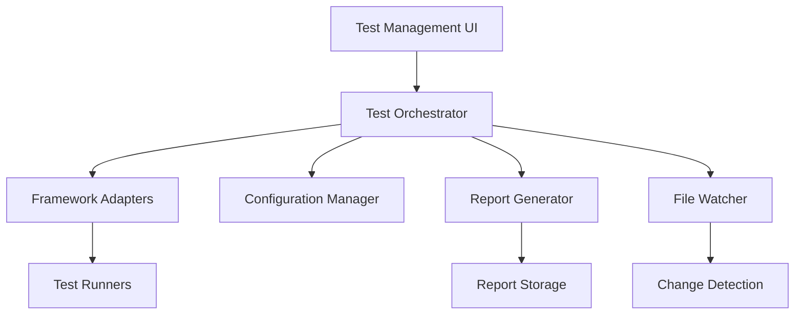

# Test Automation System Design

## Overview

The test automation system will be built as a modular, extensible platform that supports multiple testing frameworks and provides a unified interface for test management. The system will follow a plugin-based architecture to support different test runners while maintaining consistent reporting and configuration management.

## Architecture

The system follows a layered architecture with clear separation of concerns:



### Core Components

- **Test Orchestrator**: Central coordinator that manages test execution flow
- **Framework Adapters**: Pluggable adapters for different testing frameworks
- **Configuration Manager**: Handles test configuration and environment settings
- **Report Generator**: Creates and formats test reports
- **File Watcher**: Monitors file changes for automatic test triggering

## Components and Interfaces

### Test Orchestrator
```typescript
interface TestOrchestrator {
  runTests(config: TestConfig): Promise<TestResults>
  runTestSuite(suiteName: string): Promise<TestResults>
  watchMode(enabled: boolean): void
  getTestStatus(): TestStatus
}
```

### Framework Adapter Interface
```typescript
interface FrameworkAdapter {
  name: string
  detectTests(directory: string): Promise<TestFile[]>
  runTests(tests: TestFile[], config: TestConfig): Promise<TestResults>
  parseResults(output: string): TestResults
}
```

### Configuration Manager
```typescript
interface ConfigurationManager {
  loadConfig(path?: string): TestConfig
  saveConfig(config: TestConfig): void
  validateConfig(config: TestConfig): ValidationResult
  getEnvironmentConfig(env: string): EnvironmentConfig
}
```

### Report Generator
```typescript
interface ReportGenerator {
  generateReport(results: TestResults): TestReport
  generateCoverageReport(coverage: CoverageData): CoverageReport
  exportReport(report: TestReport, format: ReportFormat): string
}
```

## Data Models

### TestConfig
```typescript
interface TestConfig {
  framework: string
  testDirectory: string
  testPattern: string
  environment: EnvironmentConfig
  coverage: CoverageConfig
  reporting: ReportingConfig
  watch: WatchConfig
}
```

### TestResults
```typescript
interface TestResults {
  summary: TestSummary
  suites: TestSuite[]
  coverage?: CoverageData
  duration: number
  timestamp: Date
}

interface TestSuite {
  name: string
  tests: TestCase[]
  status: 'passed' | 'failed' | 'skipped'
  duration: number
}

interface TestCase {
  name: string
  status: 'passed' | 'failed' | 'skipped'
  duration: number
  error?: TestError
}
```

### TestReport
```typescript
interface TestReport {
  summary: TestSummary
  details: TestDetails
  coverage: CoverageReport
  trends: TestTrends
  generatedAt: Date
}
```

## Error Handling

### Test Execution Errors
- Framework adapter failures will be caught and reported with context
- Invalid test configurations will be validated before execution
- Test runner crashes will be handled gracefully with cleanup
- Network or file system errors will be retried with exponential backoff

### Configuration Errors
- Invalid configuration files will show specific validation errors
- Missing dependencies will be detected and reported with installation guidance
- Environment setup failures will provide troubleshooting steps

### Reporting Errors
- Report generation failures will fallback to basic text output
- File system write errors will attempt alternative locations
- Export format errors will provide format-specific error messages

## Testing Strategy

### Unit Testing
- Each component will have comprehensive unit tests
- Mock implementations for external dependencies
- Test coverage target of 90%+ for core components

### Integration Testing
- End-to-end test execution workflows
- Framework adapter integration tests
- Configuration loading and validation tests
- Report generation and export tests

### Performance Testing
- Large test suite execution performance
- Memory usage monitoring during long test runs
- File watching performance with many files
- Report generation speed with large datasets

### Compatibility Testing
- Multiple Node.js versions
- Different operating systems (Windows, macOS, Linux)
- Various testing framework versions
- Different project structures and configurations